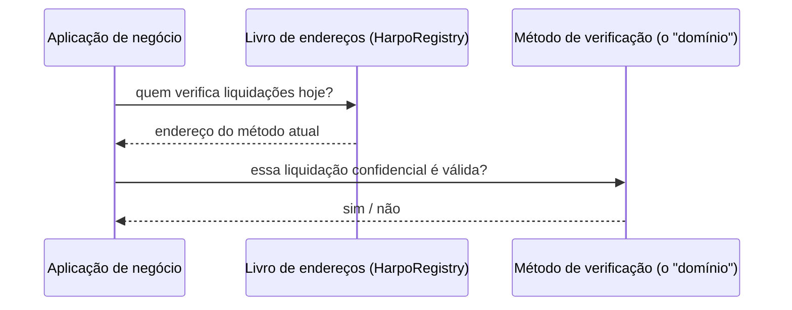
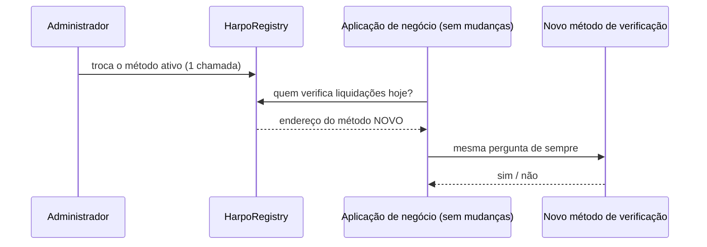
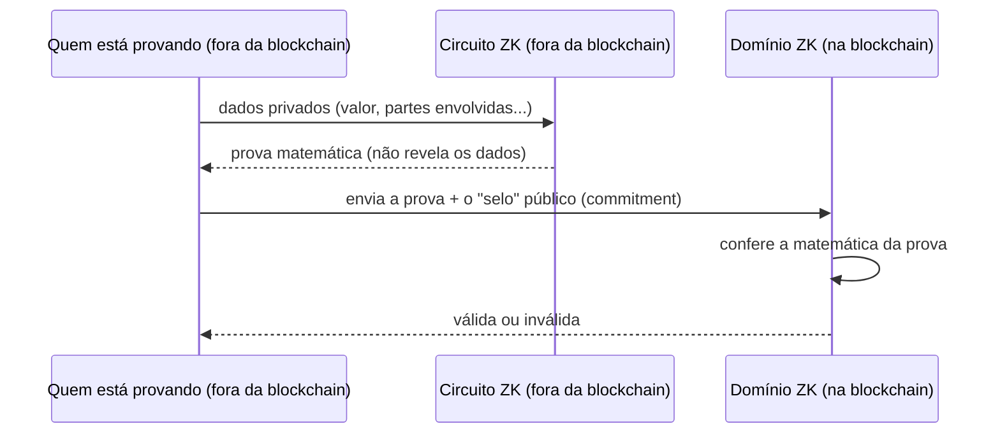
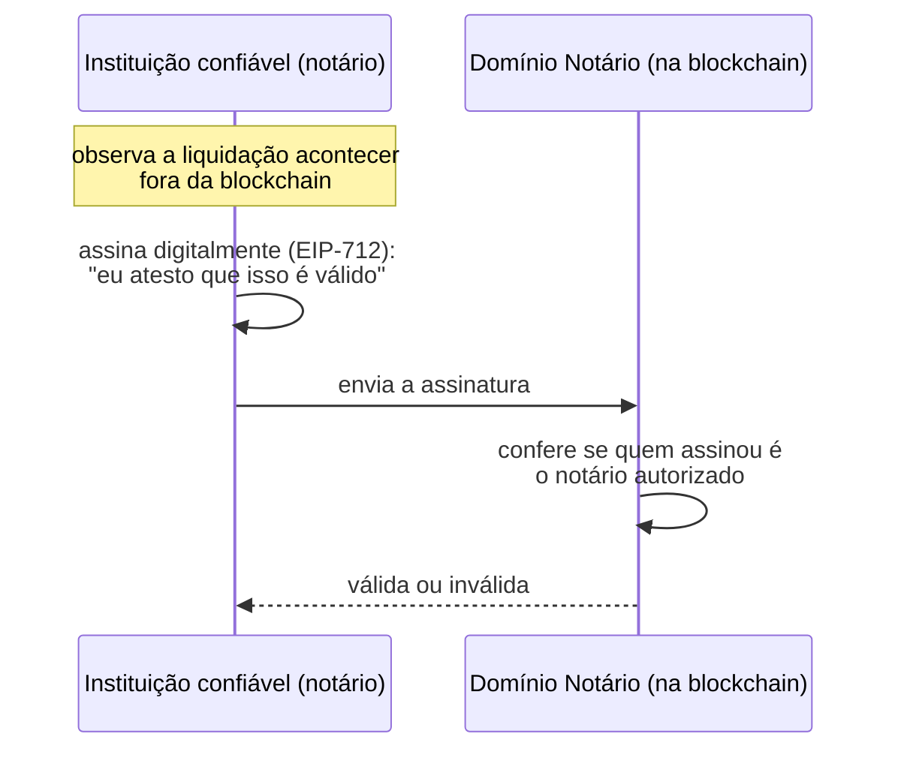
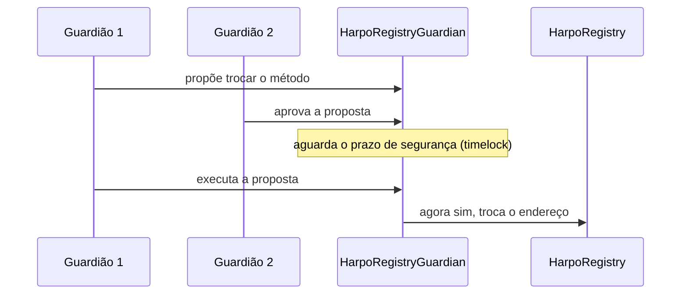
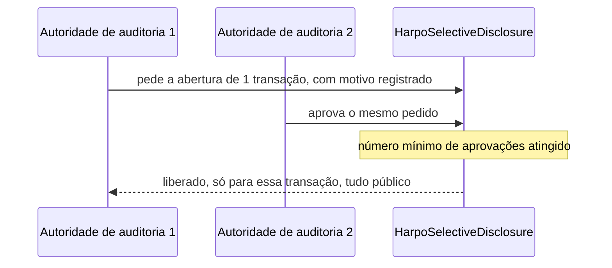
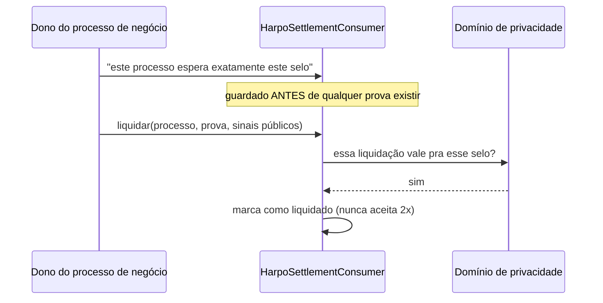

# Harpo — contratos de liquidação confidencial

Uma interface neutra para plugar diferentes mecanismos de privacidade em EVM —
ZK-SNARK (Groth16, PLONK), assinatura de notário, ou outros — sem acoplar a
aplicação a nenhum deles.

[](https://soliditylang.org/)
[](https://hardhat.org/)
[](./LICENSE)

- [O problema](#o-problema)
- [Como funciona](#como-funciona)
- [Domínios de referência](#domínios-de-referência)
- [Confiança: o que cada mecanismo exige](#confiança-o-que-cada-mecanismo-exige)
- [Governança](#governança)
- [Consumidor de referência](#consumidor-de-referência)
- [Estrutura do repositório](#estrutura-do-repositório)
- [Instalação e uso](#instalação-e-uso)
- [Testes](#testes)
- [Estado atual](#estado-atual)
- [Licença](#licença)

## O problema

Uma empresa precisa provar a um parceiro, ou a um sistema automatizado, que
determinado pagamento aconteceu e é válido — sem revelar o valor, quem pagou ou
quem recebeu. Isso é uma **liquidação confidencial**.

Há várias formas de provar isso:

- Uma **prova matemática** de conhecimento zero, que qualquer computador confere
  sozinho, sem depender da palavra de quem está provando.
- A **assinatura de uma instituição confiável**, um notário digital que atesta
  ter observado o pagamento.
- Outros métodos que ainda vão surgir.

Cada forma desloca a confiança para um lugar diferente, e nenhuma a elimina por
completo. A seção [Confiança](#confiança-o-que-cada-mecanismo-exige) detalha para
onde ela vai em cada caso.

Hoje, cada forma exige um pedaço de código diferente, colado dentro da
aplicação. Trocar de método, ou aceitar mais de um, significa reescrever a
aplicação.

Este repositório resolve isso com uma pergunta única e neutra:
`verifyConfidentialSettlement`, ou seja, "essa liquidação confidencial é
válida?". Sim ou não. A aplicação nunca precisa saber como a resposta foi
calculada, e trocar o método por trás vira configuração, não reescrita.

## Como funciona



A aplicação nunca fala direto com o ZK ou com o notário. Ela pergunta ao livro
de endereços quem está responsável agora, e faz sempre a mesma pergunta, para
quem quer que seja.

Trocar o método ativo não toca no contrato de negócio:



O código da aplicação no segundo diagrama é idêntico ao do primeiro. Só o que
está por trás do balcão mudou.

### O que isso muda para o negócio

- **Sem dependência de um fornecedor criptográfico.** Hoje o método pode ser uma
  prova ZK; amanhã, por regulação, custo ou disponibilidade, pode ser outro, sem
  parar o sistema.
- **Auditoria sob controle, não tudo ou nada.** É possível autorizar a abertura
  de uma transação específica, exigindo múltiplas aprovações, sem dar a um
  auditor acesso a tudo.
- **Dá para tirar a decisão de uma chave só.** O repositório inclui um guardião
  M-de-N com prazo de espera, que pode ser colocado na frente da troca do método.
  É uma camada opcional e precisa ser configurada: por padrão, o registry nasce
  com um único administrador.

### A interface

`IPrivacyLayer` tem três métodos:

| Método | O que devolve |
|---|---|
| `domainId()` | identificador legível do domínio |
| `privacyModel()` | a família do mecanismo (`ZK`, `NOTARY`, ...) |
| `verifyConfidentialSettlement(commitment, proof, publicInputs)` | a pergunta central: essa liquidação é válida? |

## Domínios de referência

| Domínio | Mecanismo |
|---|---|
| `HarpoZkPrivacyLayer` | ZK-SNARK (Groth16) |
| `HarpoPlonkPrivacyLayer` | ZK-SNARK (PLONK, setup universal) |
| `HarpoNotaryPrivacyLayer` | Assinatura EIP-712 de um notário confiável, sem ZK |
| `HarpoTokenPrivacyLayer` | Domínio ZK para liquidação de transferência de token |
| `HarpoZkPrivacyLayerAuditable` | Variante do domínio ZK com trilha de auditoria on-chain |

Todos implementam `ERC-165`, então é possível descobrir em tempo de execução se
um endereço é um domínio `IPrivacyLayer` válido.

## Confiança: o que cada mecanismo exige

### Domínio ZK (Groth16 / PLONK)



A blockchain nunca vê os dados privados: só confirma que a conta fecha
matematicamente. O contrato recebe apenas a prova e o commitment, que são
públicos e não revelam os dados por trás deles.

**O que o ZK não elimina.** A verificação de uma prova Groth16 depende de uma
cerimônia de setup por circuito. Quem conhecer o material secreto descartado
nessa cerimônia consegue forjar provas que o contrato aceita como válidas. Por
isso a cerimônia é feita entre várias partes independentes, e basta que uma
delas tenha sido honesta. O PLONK usa um setup universal, que serve para vários
circuitos, mas também depende de uma cerimônia. Um domínio ZK troca confiar na
contraparte por confiar em como o setup foi feito, não por não confiar em nada.

### Domínio notário



Mais simples e barato que ZK, mas troca matemática por confiança numa
instituição. Boa opção quando essa confiança já existe, como num banco regulado,
e o custo de ZK não se justifica.

## Governança

As proteções desta seção são opcionais e precisam ser configuradas. Por padrão,
`HarpoRegistry` é criado com um único endereço administrador, que troca o método
ativo com uma chamada. Para obter o comportamento dos diagramas é preciso
conceder o papel de administração ao `HarpoRegistryGuardian` e renunciar ao papel
de gerência de papéis. Caso contrário, quem o retiver pode se reconceder a
permissão e contornar o guardião.

### Trocar o método ativo, com o guardião configurado



Assim ninguém troca o método de verificação sozinho, de uma hora para outra. Dá
tempo de qualquer pessoa perceber e reagir antes da troca valer.

### Auditoria de uma transação específica, sob quórum



Nenhum auditor sozinho abre o que quiser, e cada pedido fica registrado
publicamente com o motivo, então o auditor também é auditado.

**Limite conhecido.** O quórum protege contra um auditor isolado, não contra o
administrador do contrato de disclosure: quem detém `admin` pode alterar o número
mínimo de aprovações e a lista de autoridades. Remover uma autoridade também não
apaga as aprovações que ela já havia dado. Em uso real, esse `admin` deve ser um
multisig ou um contrato de governança, não uma chave pessoal.

## Consumidor de referência



São duas garantias num contrato só. Uma prova só liquida o processo que esperava
exatamente aquele selo, então não dá para reaproveitá-la numa liquidação
diferente. E o mesmo processo não pode ser liquidado duas vezes.

## Estrutura do repositório

```
contracts/
├── interfaces/
│   ├── IPrivacyLayer.sol                           # núcleo de 3 métodos
│   └── IAuditableConfidentialSettlementDomain.sol   # extensão opcional de auditoria
├── HarpoZkPrivacyLayer.sol                         # domínio ZK/Groth16
├── HarpoPlonkPrivacyLayer.sol                      # domínio ZK/PLONK
├── HarpoNotaryPrivacyLayer.sol                     # domínio notary (sem ZK)
├── HarpoTokenPrivacyLayer.sol                      # domínio de liquidação de token
├── HarpoZkPrivacyLayerAuditable.sol                # domínio ZK auditável
├── HarpoRegistry.sol                               # address book (nome → endereço, versionado)
├── HarpoResolver.sol                               # mixin de resolução por nome, com trilha de uso
├── HarpoRegistryGuardian.sol                       # guardião M-de-N + timelock na frente do registry
├── HarpoSettlementConsumer.sol                     # consumidor de referência
├── HarpoSelectiveDisclosure.sol                    # autorização de auditoria por quórum
├── verifiers/                                      # verifiers Groth16/PLONK (código gerado)
└── mocks/                                          # mocks para teste local
test/unit/PrivacyLayer.test.js                      # suíte de smoke tests
hardhat.config.js
.env.example
```

Em `verifiers/` há seis arquivos. Três correspondem aos domínios acima
(`PixPaymentVerify`, `PixPaymentVerifyPlonk`, `TokenSettlementVerify`). Os outros
três (`ComplianceRangeVerify`, `KycInclusionVerify`, `SanctionsExclusionVerify`)
são de circuitos de compliance que ainda não têm domínio correspondente neste
repositório.

## Instalação e uso

Requer Node.js 20 ou superior, testado em 22, e npm.

```bash
npm install
npx hardhat compile
```

Deploy de um domínio, registro por nome e consumo pela interface:

```solidity
// 1. Deploy de um domínio (exemplo: notary)
HarpoNotaryPrivacyLayer layer = new HarpoNotaryPrivacyLayer(
    notaryAddress,
    auditAuthorityAddress,
    "meu-dominio-notary"
);

// 2. Registro por nome
registry.set("PrivacyLayer", address(layer));

// 3. Um consumidor resolve pelo nome e nunca precisa saber
//    qual mecanismo está por trás
IPrivacyLayer domain = IPrivacyLayer(registry.get("PrivacyLayer"));
bool ok = domain.verifyConfidentialSettlement(commitment, proof, publicInputs);
```

Trocar `HarpoNotaryPrivacyLayer` por `HarpoZkPrivacyLayer`, ou por qualquer outra
implementação de `IPrivacyLayer`, é uma única chamada `registry.set`. Nada no
consumidor muda.

## Testes

```bash
npx hardhat test
```

A suíte atual são quatro testes de smoke, todos sobre o domínio `NOTARY`, o único
que não precisa de artefatos de circuito ZK (`.wasm` e `.zkey`). Isso permite
rodar tudo neste repositório sozinho. Os circuitos que os domínios ZK verificam
vivem em [harpo-zk/circuits](https://github.com/harpo-zk/circuits).

Está coberto: assinatura EIP-712 válida, de signatário errado e com
`publicInputs` adulterados; assinatura malformada devolvendo `false` sem
reverter; `ERC-165`; e o `HarpoRegistry` resolvendo por nome, versionando e
recusando quem não tem permissão.

O arquivo de referência é
[`test/unit/PrivacyLayer.test.js`](test/unit/PrivacyLayer.test.js). O último
bloco mostra a resolução por nome chamando a interface diretamente; um contrato
consumidor ainda não é exercitado ali.

## Estado atual

Este é um repositório de implementação de referência, em desenvolvimento. O que
vale saber antes de usar:

- **Sem cobertura de teste** para `HarpoSettlementConsumer`,
  `HarpoRegistryGuardian`, `HarpoSelectiveDisclosure`,
  `HarpoZkPrivacyLayerAuditable`, `HarpoTokenPrivacyLayer` e `HarpoResolver`.
  Eles compilam, e as garantias que implementam estão descritas nos diagramas
  acima, mas a evidência ainda não está na suíte.
- **Sem auditoria externa** de nenhum contrato.
- **As cerimônias de setup dos circuitos ZK** são de desenvolvimento, não de
  produção. Ver [harpo-zk/circuits](https://github.com/harpo-zk/circuits).
- **Governança e disclosure** têm os limites descritos nas seções acima: são
  camadas opcionais, e o administrador retém poderes de configuração.

## Licença

Apache-2.0 (ver [`LICENSE`](LICENSE)). Alguns arquivos individuais podem
declarar uma licença diferente no próprio cabeçalho SPDX.
