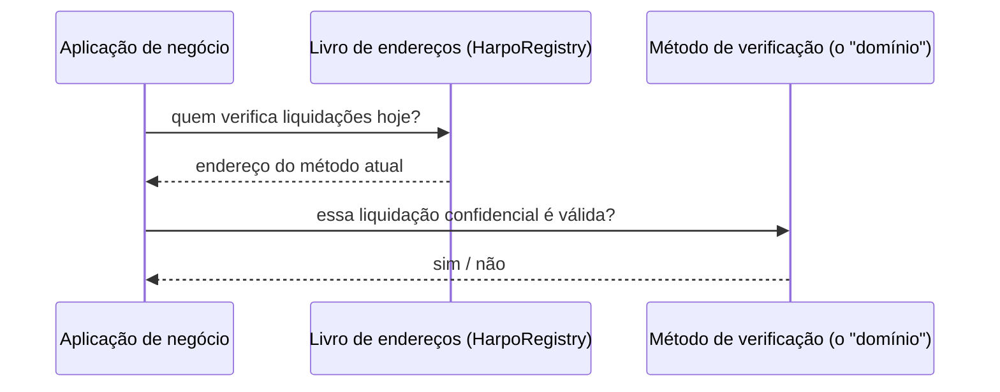
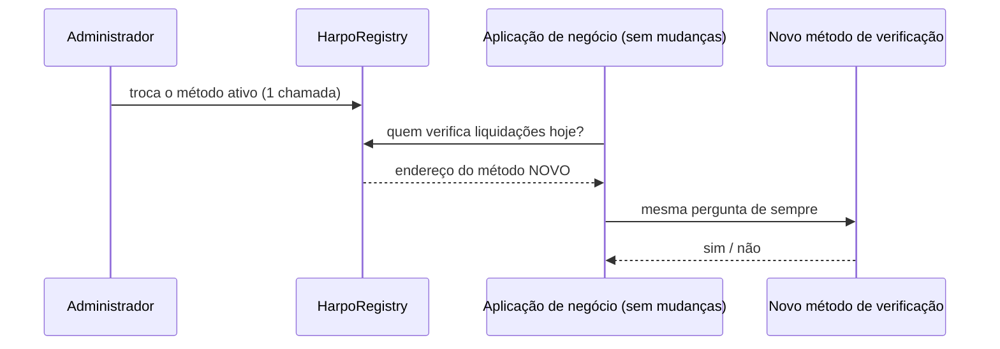
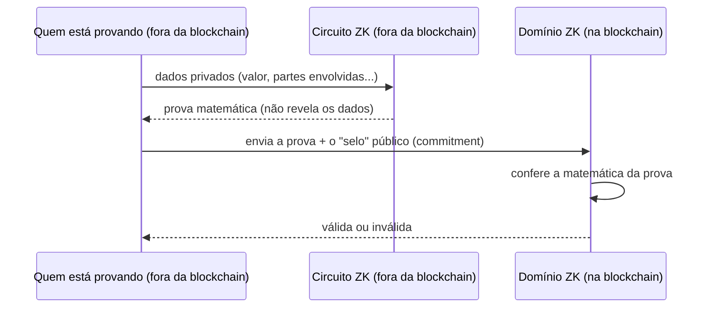
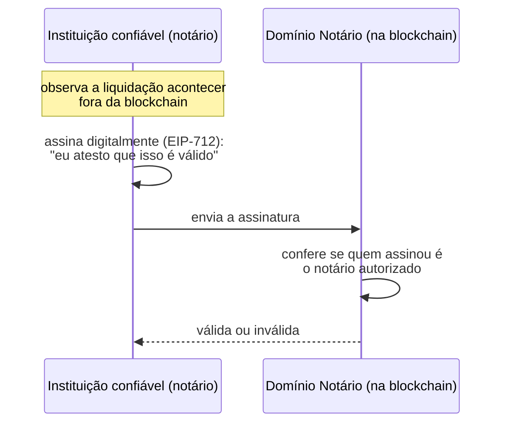
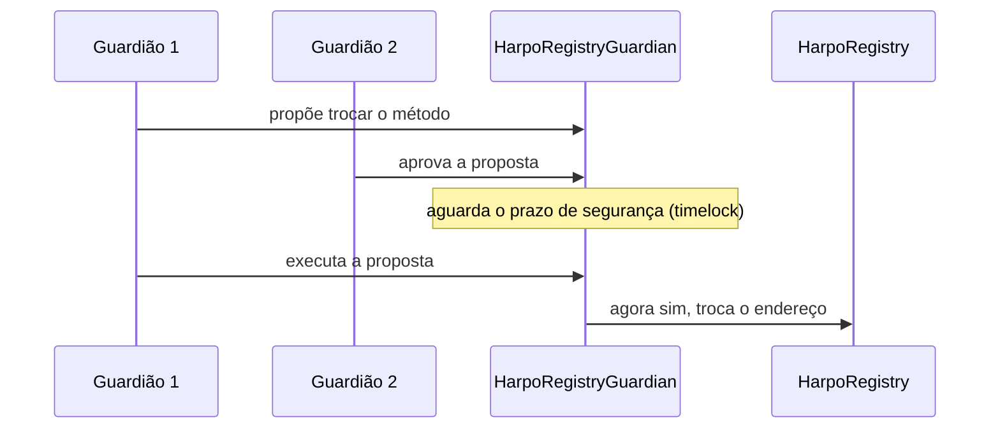
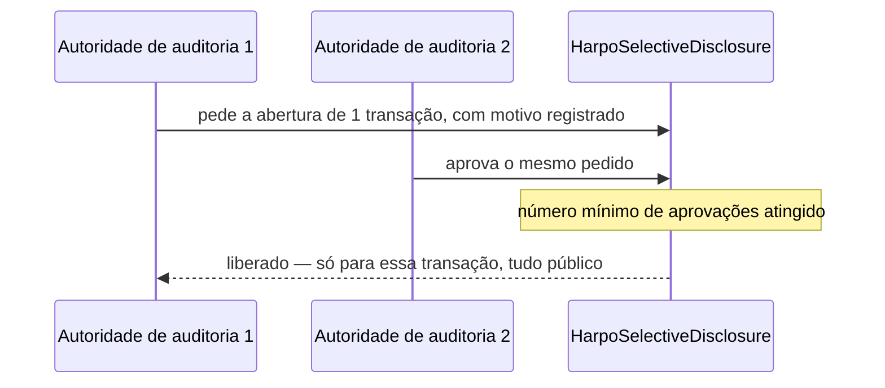
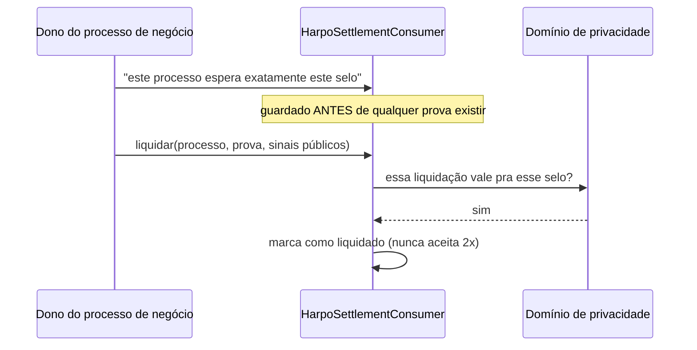

# 🔐 Harpo Smart Contracts

<div align="center">

```
██╗  ██╗ █████╗ ██████╗ ██████╗  ██████╗
██║  ██║██╔══██╗██╔══██╗██╔══██╗██╔═══██╗
███████║███████║██████╔╝██████╔╝██║   ██║
██╔══██║██╔══██║██╔══██╗██╔═══╝ ██║   ██║
██║  ██║██║  ██║██║  ██║██║     ╚██████╔╝
╚═╝  ╚═╝╚═╝  ╚═╝╚═╝  ╚═╝╚═╝      ╚═════╝
```

**🔒 Camada de liquidação confidencial, agnóstica de mecanismo, para EVM**

*Uma interface neutra para plugar diferentes mecanismos de privacidade — ZK-SNARK
(Groth16, PLONK), assinatura de notário, ou outros — sem acoplar a aplicação a
nenhum deles*

[](https://soliditylang.org/)
[](https://hardhat.org/)
[](./LICENSE)

</div>

---

## 🧠 O que isso resolve (sem jargão técnico)

Imagine que uma empresa precisa provar pra um parceiro, ou pra um sistema
automatizado, que **"esse pagamento aconteceu e é válido"** — mas sem revelar
o valor, nem quem pagou, nem quem recebeu. Isso é uma **liquidação
confidencial**.

Existem várias formas de provar isso sem revelar os dados:

- Uma **prova matemática** (criptografia de conhecimento zero — "ZK"), que
  qualquer computador consegue conferir sozinho, sem confiar em ninguém.
- A **assinatura de uma instituição confiável** (um "notário" digital) que
  atesta que observou o pagamento acontecer.
- Outros métodos que ainda vão surgir.

O problema: hoje, cada forma exige escrever um pedaço de código diferente,
colado direto na aplicação. Se a empresa quiser trocar de método depois — ou
aceitar mais de um — precisa **reescrever a aplicação**.

**Este repositório resolve isso com uma pergunta única e neutra:**
`verifyConfidentialSettlement` — "essa liquidação confidencial é válida?" Sim
ou não. A aplicação nunca precisa saber *como* a resposta foi calculada.
Trocar o método por trás é uma configuração, não uma reescrita.



*A aplicação nunca fala direto com "o ZK" ou "o notário" — ela pergunta pro
livro de endereços quem está responsável agora, e faz sempre a mesma
pergunta, para quem quer que seja.*

### Por que isso importa pro negócio

- **Sem vendor lock-in criptográfico.** Hoje o método pode ser uma prova ZK;
  amanhã, por regulação, custo, ou disponibilidade de fornecedor, pode virar
  outro — sem parar o sistema nem reescrever a aplicação.
- **Auditoria sob controle, não tudo-ou-nada.** É possível autorizar a
  abertura de uma transação específica para um auditor, com múltiplas
  aprovações exigidas — sem dar a um único auditor acesso a tudo.
- **Nenhuma chave única decide sozinha.** Trocar o método de verificação em
  produção exige várias pessoas concordando e um prazo de espera — não é uma
  ação de um clique de um único administrador.



*O código da aplicação nesse segundo diagrama é **idêntico** ao do primeiro —
só o que está "por trás do balcão" mudou.*

---

## 🎯 Visão geral (técnica)

Este repositório resolve o problema acima com uma interface pequena e
estável, `IPrivacyLayer`, e várias implementações (**domínios**) atrás dela:

- **`domainId()`** — identificador legível do domínio.
- **`privacyModel()`** — a família do mecanismo (`ZK`, `NOTARY`, ...).
- **`verifyConfidentialSettlement(commitment, proof, publicInputs)`** — a
  pergunta central: essa liquidação confidencial é válida?

A aplicação consumidora fala só com a interface. Trocar o domínio por trás
dela é uma chamada de registry — sem tocar no contrato de negócio.

### Domínios de referência incluídos

| Domínio | Mecanismo |
|---|---|
| `HarpoZkPrivacyLayer` | ZK-SNARK (Groth16) |
| `HarpoPlonkPrivacyLayer` | ZK-SNARK (PLONK, setup universal) |
| `HarpoNotaryPrivacyLayer` | Assinatura EIP-712 de um notário confiável — zero ZK |
| `HarpoTokenPrivacyLayer` | Domínio ZK para liquidação de transferência de token |
| `HarpoZkPrivacyLayerAuditable` | Variante do domínio ZK com trilha de auditoria on-chain |

Todos implementam `ERC-165` (`supportsInterface`), então é possível descobrir
em tempo de execução se um endereço é um domínio `IPrivacyLayer` válido.

## 🔀 Como cada domínio verifica uma liquidação, por dentro

### Domínio ZK (Groth16 / PLONK) — prova matemática, sem confiar em ninguém



*A blockchain **nunca vê** os dados privados — só confirma que a "conta
fecha" matematicamente. Ninguém, nem o próprio contrato, aprende o valor ou
quem participou.*

### Domínio Notário — uma instituição confiável atesta, sem ZK



*Mais simples e barato que ZK, mas troca "matemática" por "confiar numa
instituição". Boa opção quando essa confiança já existe (ex.: um banco
regulado) e o custo/complexidade de ZK não se justifica.*

## 🛡️ Governança: nenhuma chave única decide sozinha

### Trocar o método ativo exige várias aprovações + prazo de espera



*Ninguém troca o "método de verificação" sozinho, de uma hora pra outra. Dá
tempo de qualquer pessoa perceber e reagir antes da troca valer.*

### Auditoria de uma transação específica, sob quórum



*Nenhum auditor sozinho abre o que quiser. E cada pedido de abertura fica
registrado publicamente, com o motivo — o auditor também é auditado.*

## 📦 Consumidor de referência: amarrado ao processo, sem replay



*Duas garantias num contrato só: (1) uma prova só liquida o processo que
"esperava" exatamente aquele selo — não dá pra reaproveitar numa liquidação
diferente; (2) o mesmo processo não pode ser liquidado duas vezes.*

## 🏗️ Estrutura

```
contracts/
├── interfaces/
│   ├── IPrivacyLayer.sol                      # núcleo de 3 métodos
│   └── IAuditableConfidentialSettlementDomain.sol  # extensão opcional de auditoria
├── HarpoZkPrivacyLayer.sol                    # domínio ZK/Groth16
├── HarpoPlonkPrivacyLayer.sol                 # domínio ZK/PLONK
├── HarpoNotaryPrivacyLayer.sol                # domínio notary (sem ZK)
├── HarpoTokenPrivacyLayer.sol                 # domínio de liquidação de token
├── HarpoZkPrivacyLayerAuditable.sol           # domínio ZK auditável
├── HarpoRegistry.sol                          # address book (nome → endereço, versionado)
├── HarpoResolver.sol                          # mixin de resolução por nome, com trilha de uso
├── HarpoRegistryGuardian.sol                  # guardião M-de-N + timelock na frente do registry
├── HarpoSettlementConsumer.sol                # consumidor de referência
├── HarpoSelectiveDisclosure.sol               # autorização de auditoria por quórum
├── verifiers/                                 # verifiers Groth16/PLONK (código gerado)
└── mocks/                                     # mocks para teste local
```

## ⚙️ Instalação e uso

### Pré-requisitos

- Node.js 18+
- npm

### Configuração

```bash
npm install
npx hardhat compile
```

### Testes

```bash
npx hardhat test
```

Os testes cobrem o domínio `NOTARY` de ponta a ponta (assinatura EIP-712
válida/inválida/adulterada, `ERC-165`, resolução por nome via `HarpoRegistry`,
composição registry → consumidor) sem depender de artefatos de circuito ZK
(`.wasm`/`.zkey`). Os circuitos que os domínios ZK verificam vivem em
[`harpo-zk/circuits`](https://github.com/harpo-zk/circuits).

## 📦 Uso básico

```solidity
// 1. Deploy de um domínio (exemplo: notary)
HarpoNotaryPrivacyLayer layer = new HarpoNotaryPrivacyLayer(
    notaryAddress,
    auditAuthorityAddress,
    "meu-dominio-notary"
);

// 2. Registro por nome
registry.set("PrivacyLayer", address(layer));

// 3. Um consumidor resolve pelo nome e nunca precisa saber qual mecanismo está por trás
IPrivacyLayer domain = IPrivacyLayer(registry.get("PrivacyLayer"));
bool ok = domain.verifyConfidentialSettlement(commitment, proof, publicInputs);
```

Trocar `HarpoNotaryPrivacyLayer` por `HarpoZkPrivacyLayer` (ou qualquer outra
implementação de `IPrivacyLayer`) é uma única chamada `registry.set(...)` —
nada no consumidor muda.

## 🧪 Teste de referência

[`test/unit/PrivacyLayer.test.js`](test/unit/PrivacyLayer.test.js) demonstra o
fluxo completo (deploy do domínio, registro por nome, verificação de uma
liquidação, casos de rejeição) sem depender de artefatos de circuito ZK.

## 📄 Licença

Apache-2.0 (ver [`LICENSE`](LICENSE)). Alguns arquivos individuais podem
declarar uma licença diferente no próprio cabeçalho SPDX.
