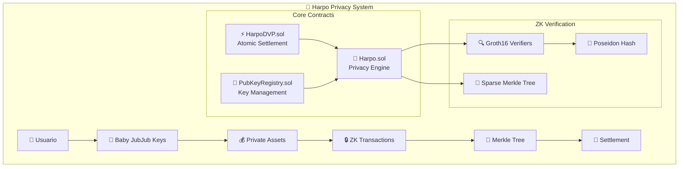
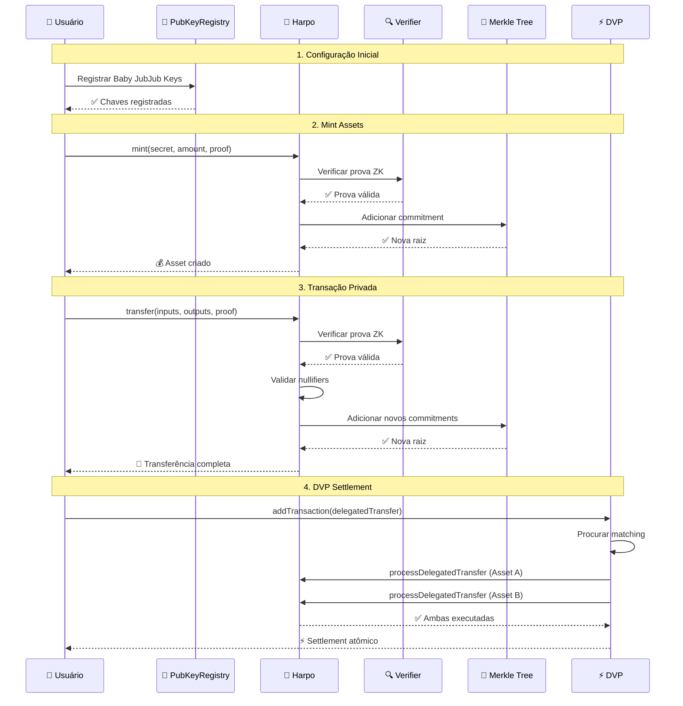
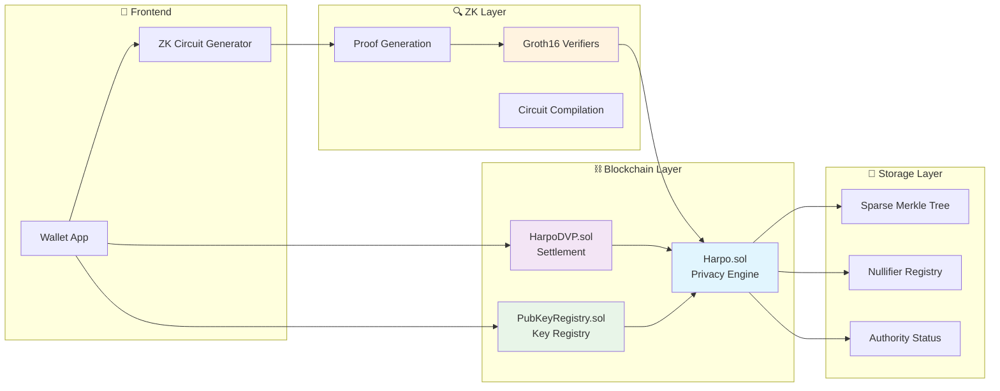
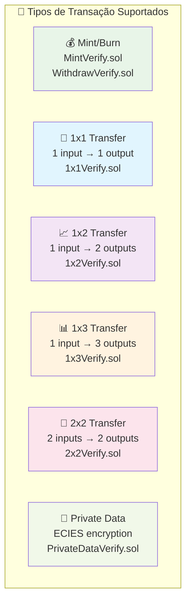

# 🔐 Harpo Smart Contracts

<div align="center">

```
██╗  ██╗ █████╗ ██████╗ ██████╗  ██████╗
██║  ██║██╔══██╗██╔══██╗██╔══██╗██╔═══██╗
███████║███████║██████╔╝██████╔╝██║   ██║
██╔══██║██╔══██║██╔══██╗██╔═══╝ ██║   ██║
██║  ██║██║  ██║██║  ██║██║     ╚██████╔╝
╚═╝  ╚═╝╚═╝  ╚═╝╚═╝  ╚═╝╚═╝      ╚═════╝
```

**🛡️ Zero-Knowledge Privacy Protocol para Blockchain**

*Transações UTXO que preservam privacidade com verificação ZK-SNARK e auditoria regulatória*

[](./test)
[](https://soliditylang.org/)
[](https://hardhat.org/)
[](./LICENSE)

</div>

---

## 🌟 Visão Geral do Sistema

<div align="center">



</div>

### 🎯 Principais Características

<table>
<tr>
<td width="50%">

#### 🔒 **Privacidade Total**
- Transações UTXO preservam privacidade
- Zero-knowledge proofs (ZK-SNARKs)
- Valores e endereços ocultos
- Apenas commitments públicos

</td>
<td width="50%">

#### ⚡ **Liquidação Atômica**
- Delivery vs Payment (DVP)
- Execução tudo-ou-nada
- Matching automático
- Multi-asset swaps

</td>
</tr>
<tr>
<td width="50%">

#### 🏛️ **Conformidade Regulatória**
- Controle de autoridade
- Capacidades de auditoria
- Bloqueio/resgate de ativos
- Transparência seletiva

</td>
<td width="50%">

#### 🚀 **Alta Performance**
- Sparse Merkle Trees otimizadas
- Verificação Groth16 eficiente
- Gas otimizado para ZK
- Batching de operações

</td>
</tr>
</table>

---

## 📋 Índice

- [Visão Geral](#visão-geral)
- [Pré-requisitos](#pré-requisitos)
- [Início Rápido](#início-rápido)
- [Arquitetura dos Contratos](#arquitetura-dos-contratos)
- [Testes](#testes)
- [Deployment](#deployment)
- [Desenvolvimento](#desenvolvimento)
- [Solução de Problemas](#solução-de-problemas)

## 🎯 Visão Geral

Os Contratos Harpo implementam um sistema completo de privacidade on-chain incluindo:

- **Transações Privadas UTXO**: Transferências 1x1, 1x2, 1x3, 2x2 com preservação de privacidade
- **Verificação ZK-SNARK**: Integração com provas Groth16 para validação criptográfica
- **Delivery vs Payment (DVP)**: Liquidação atômica entre diferentes tipos de ativos
- **Controle de Autoridade**: Mecanismos de bloqueio/resgate de ativos para conformidade
- **Sparse Merkle Trees**: Gerenciamento eficiente de commitments com histórico de raízes
- **Registro de Chaves Públicas**: Mapeamento de endereços Ethereum para chaves Baby JubJub

## ⚙️ Pré-requisitos

### Software Necessário
- **Node.js** (v16 ou superior)
- **Hardhat** (framework de desenvolvimento Ethereum)
- **Git** (para clonar)

### Dependências Criptográficas
- **circomlibjs** - Utilitários criptográficos para JavaScript
- **snarkjs** - Biblioteca para provas ZK-SNARK
- **ffjavascript** - Aritmética de campo finito

## 🚀 Início Rápido

### 1. Clonar e Instalar
```bash
git clone <repository-url>
cd harpo-contracts
npm install
```

### 2. Configurar Ambiente
```bash
# Copiar arquivo de configuração
cp .env.example .env

# Editar variáveis de ambiente (opcional para desenvolvimento local)
PRIVATE_KEY="sua_chave_privada_aqui"
SEPOLIA_URL="https://rpc.sepolia.org"
ETHERSCAN_API_KEY="sua_api_key_etherscan"
```

### 3. Verificar Instalação
```bash
# Verificar versão do Node.js
node --version
# Deve mostrar: v16+ ou superior

# Verificar Hardhat
npx hardhat --version
# Deve mostrar versão do Hardhat instalada
```

### 4. Executar Testes
```bash
# Executar todos os testes
npm test

# Executar categorias específicas
npm run test:unit          # Testes unitários
npm run test:integration   # Testes de integração
npm run test:report        # Testes com relatório HTML
```

### 5. Compilar Contratos
```bash
# Compilar todos os contratos
npm run compile

# Limpar e recompilar
npm run clean && npm run compile
```

## 🏗️ Arquitetura dos Contratos

### 🔄 Fluxo de Transação Privada

<div align="center">



</div>

### 📊 Arquitetura de Componentes

<div align="center">



</div>

### Contratos Core

#### **Harpo.sol** - Contrato Principal de Privacidade
```solidity
// Funcionalidades principais:
- Mint/Burn de ativos privados com provas ZK
- Transferências privadas (1x1, 1x2, 1x3, 2x2)
- Gerenciamento de nullifiers (prevenção double-spending)
- Controle de autoridade para conformidade regulatória
- Integração com Sparse Merkle Trees
```

#### **HarpoDVP.sol** - Delivery vs Payment
```solidity
// Liquidação atômica entre ativos:
- Matching automático de transações
- Execução atômica (tudo ou nada)
- Comparação de secrets para matching
- Limpeza automática de transações executadas
```

#### **PubKeyRegistry.sol** - Registro de Chaves Públicas
```solidity
// Gerenciamento de chaves:
- Mapeamento Ethereum → Baby JubJub
- Controle de acesso baseado em roles
- Registro por proprietário ou admin
```

### Bibliotecas Criptográficas

#### **SmtLib.sol** - Sparse Merkle Tree
```solidity
// Funcionalidades:
- Inserção eficiente de folhas
- Histórico de raízes mantido
- Geração de provas de inclusão
- Verificação de existência de raízes
```

#### **Poseidon (T2, T3, T4, T6)** - Funções Hash
```solidity
// Hash otimizado para ZK:
- Múltiplas variações para diferentes tamanhos de entrada
- Otimizado para circuitos ZK-SNARK
- Compatível com circomlib
```

### 🔍 Verificadores ZK-SNARK

<div align="center">



</div>

#### **Groth16 Verifiers - Estatísticas**

<table align="center">
<tr>
<th>Verificador</th>
<th>Inputs Públicos</th>
<th>Uso</th>
<th>Complexidade</th>
</tr>
<tr>
<td>🏭 MintVerify</td>
<td>4</td>
<td>Criação de assets</td>
<td>⭐⭐</td>
</tr>
<tr>
<td>🔥 WithdrawVerify</td>
<td>4</td>
<td>Queima de assets</td>
<td>⭐⭐</td>
</tr>
<tr>
<td>🔄 1x1Verify</td>
<td>13</td>
<td>Transferência simples</td>
<td>⭐⭐⭐</td>
</tr>
<tr>
<td>📈 1x2Verify</td>
<td>14</td>
<td>Split de assets</td>
<td>⭐⭐⭐⭐</td>
</tr>
<tr>
<td>📊 1x3Verify</td>
<td>16</td>
<td>Multi-output</td>
<td>⭐⭐⭐⭐⭐</td>
</tr>
<tr>
<td>🔀 2x2Verify</td>
<td>16</td>
<td>Join + Split</td>
<td>⭐⭐⭐⭐⭐</td>
</tr>
</table>

## 🧪 Testes

### Estrutura de Testes
```
test/
├── .mocharc.json         # Configuração Mocha
├── unit/                 # Testes unitários
│   ├── Harpo.test.js    # Testes do contrato principal
│   └── PubKeyRegistry.test.js # Testes de registro de chaves
├── integration/          # Testes de integração
│   ├── HarpoDVP.test.js # Testes DVP básicos
│   └── HarpoDVPWithChange.test.js # Testes DVP com troco
├── utils/               # Utilitários de teste
│   └── testHelpers.js   # Helpers criptográficos
└── results/             # Relatórios de teste (HTML & JSON)
```

### Executando Testes

#### Todos os Testes
```bash
npm test                    # Testes completos (43 aprovados, 0 falharam)
npm run test:unit          # Apenas testes unitários
npm run test:integration   # Testes de integração
npm run test:watch         # Modo watch para desenvolvimento
```

#### Status Atual dos Testes
- **Testes Totais**: 43 aprovados, 0 falharam ✅
- **Cobertura**: Contratos core, DVP, registry e bibliotecas
- **Tipos**: Unitários, integração, edge cases e performance
- **Relatórios**: HTML e JSON gerados automaticamente

#### Comandos de Teste Disponíveis
```bash
# Comandos Principais
npm test                    # Executar todos os testes
npm run test:unit          # Testes unitários apenas
npm run test:integration   # Testes de integração apenas
npm run test:report        # Gerar relatório HTML/JSON
npm run test:watch         # Modo watch para desenvolvimento

# Desenvolvimento e Depuração
npm run coverage           # Análise de cobertura de código
npm run clean             # Limpar artefatos e cache
npm run compile           # Compilar contratos
```

#### Relatórios de Teste
Os relatórios são gerados automaticamente em `test/results/`:
- **Relatório HTML**: `test/results/contract-test-report.html` - Interface interativa
- **Relatório JSON**: `test/results/contract-test-report.json` - Dados estruturados

### Categorias de Teste

#### ✅ **Testes de Contrato Principal (Harpo.sol)**
- Deployment e inicialização
- Operações mint/burn com provas ZK
- Transferências privadas (1x1, 1x2, 1x3, 2x2)
- Controle de autoridade (bloqueio/desbloqueio)
- Gerenciamento de nullifiers
- Integração com Sparse Merkle Trees

#### ✅ **Testes DVP (HarpoDVP.sol)**
- Setup e configuração
- Matching automático de transações
- Execução atômica
- Cenários com múltiplos outputs
- Transferências com troco
- Cleanup de transações
- Performance com múltiplas transações pendentes

#### ✅ **Testes de Registro (PubKeyRegistry.sol)**
- Controle de acesso baseado em roles
- Registro de chaves Baby JubJub
- Edge cases (valores zero, máximos)
- Integração OpenZeppelin AccessControl

#### ✅ **Testes de Integração**
- Fluxos completos DVP
- Interações multi-contrato
- Cenários de conformidade regulatória
- Casos de erro e recuperação

## 🚀 Deployment

### Rede Local (Hardhat)
```bash
# Iniciar nó local
npm run node

# Em outro terminal, fazer deploy
npm run deploy
```

### Testnet (Sepolia)
```bash
# Configurar .env com SEPOLIA_URL e PRIVATE_KEY
npm run deploy -- --network sepolia
```

### Mainnet
```bash
# ⚠️ ATENÇÃO: Verificar duas vezes antes do deploy em mainnet
npm run deploy -- --network mainnet
```

### Verificação de Contratos
```bash
# Verificar no Etherscan (após deploy)
npx hardhat verify --network sepolia <CONTRACT_ADDRESS> <CONSTRUCTOR_ARGS>
```

## 🔧 Desenvolvimento

### Estrutura do Projeto
```
harpo-contracts/
├── contracts/              # Contratos principais
│   ├── Harpo.sol          # Contrato principal de privacidade
│   ├── HarpoDVP.sol       # Delivery vs Payment
│   ├── PubKeyRegistry.sol # Registro de chaves públicas
│   ├── libs/              # Bibliotecas criptográficas
│   ├── verifiers/         # Verificadores Groth16
│   └── mocks/             # Contratos mock para testes
├── test/                   # Framework de teste
├── scripts/               # Scripts de deployment
├── hardhat.config.js      # Configuração Hardhat
├── package.json           # Dependências e scripts
└── README.md             # Documentação do projeto
```

### Adicionando Novos Contratos

1. **Criar Arquivo de Contrato**
```solidity
// contracts/MeuNovoContrato.sol
// SPDX-License-Identifier: GPL-3.0
pragma solidity ^0.8.27;

import "./Harpo.sol";

contract MeuNovoContrato {
    Harpo public harpo;

    constructor(address _harpoAddress) {
        harpo = Harpo(_harpoAddress);
    }

    // Lógica do contrato aqui
}
```

2. **Criar Testes**
```javascript
// test/unit/MeuNovoContrato.test.js
const { expect } = require("chai");
const { ethers } = require("hardhat");

describe("MeuNovoContrato", function () {
    let contract;

    beforeEach(async function () {
        // Setup do teste
    });

    it("deve funcionar corretamente", async function () {
        // Lógica do teste
    });
});
```

### Configuração de Desenvolvimento

#### Hardhat
```javascript
// hardhat.config.js - Principais configurações:
solidity: "0.8.27"           // Versão Solidity
optimizer: enabled (200 runs) // Otimizador habilitado
viaIR: true                  // Compilação via IR
gasLimit: 30M                // Limite de gas aumentado
timeout: 120s                // Timeout para ZK operations
```

#### Dependências Principais
- **`@openzeppelin/contracts`** - Contratos padrão OpenZeppelin
- **`circomlibjs`** - Utilitários criptográficos
- **`snarkjs`** - Biblioteca ZK-SNARK
- **`hardhat`** - Framework de desenvolvimento
- **`chai`** - Biblioteca de asserções para testes

### Depuração

#### Problemas de Compilação
```bash
# Compilar com saída verbosa
npx hardhat compile --verbose

# Verificar dependências
npm run clean && npm install && npm run compile
```

#### Depuração de Testes
```bash
# Executar teste específico
npx hardhat test test/unit/Harpo.test.js

# Com timeout customizado para operações ZK
npx hardhat test --timeout 300000

# Debug de transações
npx hardhat test --network hardhat --verbose
```

## ⚠️ Solução de Problemas

### Problemas Comuns

#### "Contract code size exceeds limit"
```bash
# Solução: Otimizador já habilitado no hardhat.config.js
# Para contratos muito grandes, considerar usar libraries
```

#### Timeout em Testes ZK
```bash
# Configuração já otimizada em .mocharc.json e hardhat.config.js
# Para circuitos complexos, aumentar timeout:
npx hardhat test --timeout 600000
```

#### Erro "Nenhuma prova valida fornecida"
```javascript
// Garantir que exatamente uma prova seja fornecida (não ambas):
transfer.proof = createMockProofWithInputs(13);      // ✅ Valid
transfer.proof1x3 = createEmptyProofWithInputs(16); // ✅ Empty
```

#### Problemas de Gas
```bash
# Configuração já otimizada para operações ZK:
gasLimit: 30000000           // 30M gas limit
blockGasLimit: 30000000      // Block gas limit
allowUnlimitedContractSize: true  // Sem limite de tamanho
```

### Problemas de Performance

#### Compilação Lenta
- Usar `viaIR: true` (já configurado)
- Optimizer habilitado com 200 runs
- Cache do Hardhat habilitado

#### Testes Lentos
- Timeouts otimizados (120s)
- Mock verifiers para testes rápidos
- Paralelização quando possível

### Problemas de Rede

#### Falha de Deploy
```bash
# Verificar configuração de rede
npx hardhat network

# Verificar saldo da conta
npx hardhat run scripts/check-balance.js --network sepolia
```

#### Transações Pendentes
```bash
# Verificar mempool
npx hardhat run scripts/check-pending.js --network sepolia

# Cancelar transação pendente (se necessário)
npx hardhat run scripts/cancel-tx.js --network sepolia
```

### Obtendo Ajuda

1. **Documentação**: Este README para referência completa
2. **Testes**: Exemplos em `test/unit/` e `test/integration/`
3. **Hardhat**: Documentação em https://hardhat.org/docs
4. **Issues**: Criar issue no GitHub com logs e detalhes do ambiente

## 📝 Recursos Adicionais

- **Documentação Hardhat**: https://hardhat.org/docs
- **OpenZeppelin**: https://docs.openzeppelin.com/contracts
- **Circom**: https://docs.circom.io/
- **Solidity**: https://docs.soliditylang.org/

## 🏆 Dashboard do Projeto

<div align="center">

### 📊 Métricas de Qualidade

<table>
<tr>
<td align="center">
<h4>🧪 Testes</h4>

<br><strong>100% Success Rate</strong>
</td>
<td align="center">
<h4>⚙️ Compilação</h4>

<br><strong>Zero Errors</strong>
</td>
<td align="center">
<h4>🔐 Segurança</h4>

<br><strong>Groth16 Verified</strong>
</td>
</tr>
<tr>
<td align="center">
<h4>📈 Cobertura</h4>

<br><strong>Core + Integração</strong>
</td>
<td align="center">
<h4>⚡ Performance</h4>

<br><strong>30M Gas Limit</strong>
</td>
<td align="center">
<h4>🚀 Status</h4>

<br><strong>Deploy Ready</strong>
</td>
</tr>
</table>

### 📈 Estatísticas Detalhadas

<table align="center">
<tr>
<th>Componente</th>
<th>Contratos</th>
<th>Testes</th>
<th>Status</th>
</tr>
<tr>
<td>🔐 Privacy Core</td>
<td>Harpo.sol</td>
<td>15 testes</td>
<td>✅ Completo</td>
</tr>
<tr>
<td>⚡ DVP Settlement</td>
<td>HarpoDVP.sol</td>
<td>18 testes</td>
<td>✅ Completo</td>
</tr>
<tr>
<td>🔑 Key Registry</td>
<td>PubKeyRegistry.sol</td>
<td>10 testes</td>
<td>✅ Completo</td>
</tr>
<tr>
<td>📚 Libraries</td>
<td>SmtLib, Poseidon</td>
<td>Integrado</td>
<td>✅ Completo</td>
</tr>
<tr>
<td>🔍 ZK Verifiers</td>
<td>6 verificadores</td>
<td>Mock tested</td>
<td>✅ Completo</td>
</tr>
</table>

</div>

---

**Construído com ❤️ para tecnologia blockchain que preserva privacidade**